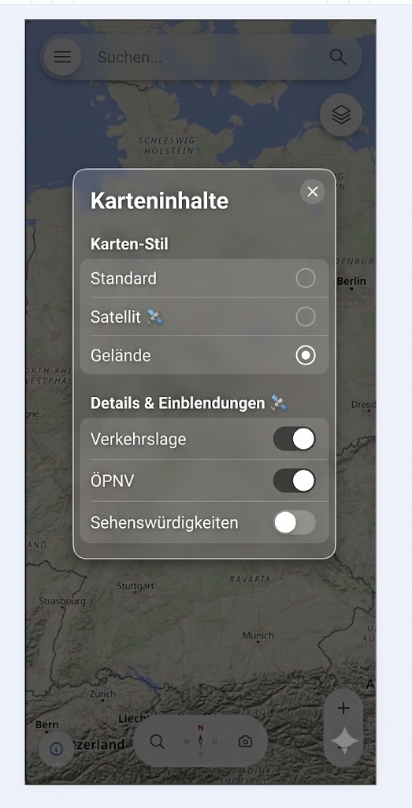
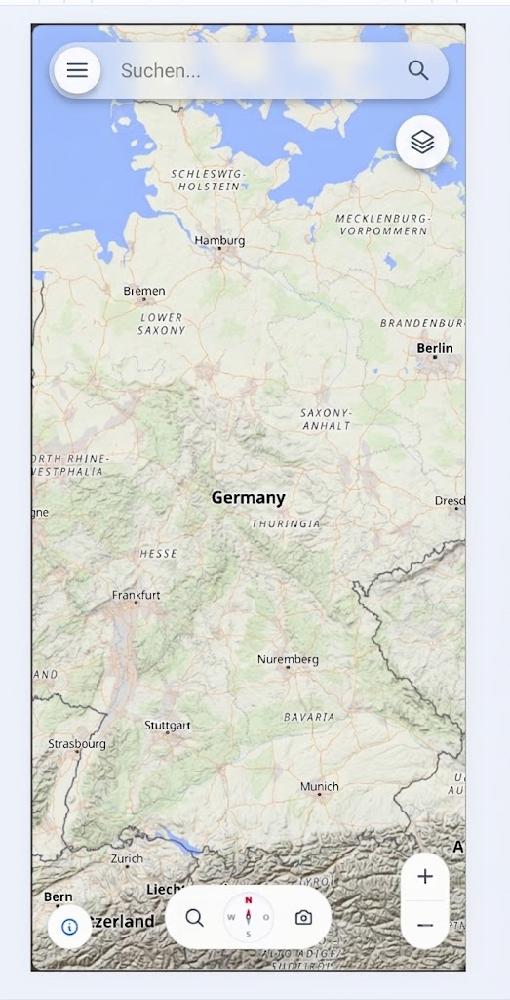
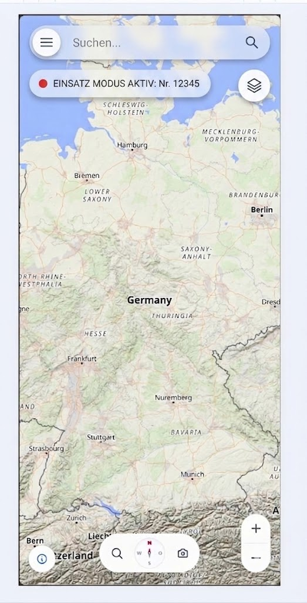

# Offene kleine auffälligkeiten als ToDo

- [ ] Mapeinstellung wird nicht gemerk (appspeicher)
- [ ] alle länder außer Deutschland sollen leicht ausgegraut werden und der Navigationsberich soll nur über deutschland sein also so eine art eingrenzen.
- [ ] Performance Optimierungen bei dem 3D Gelände
- [ ] Gebäude verändern ihre höhen wenn das 3D Gelände an ist und sind somit nicht mehr realistisch
- [ ] Satelit troggle in den Mapeinstellungen
- [ ] Teile der gesehenen karte für bessere Performance in dem Appspeicher speichern (vorversion zur offline karte)

# Erweiterungen
- [ ] Maplayer Button
  - [ ] Maplayer Modal
  
  

- [ ] Search Button on the map
  

